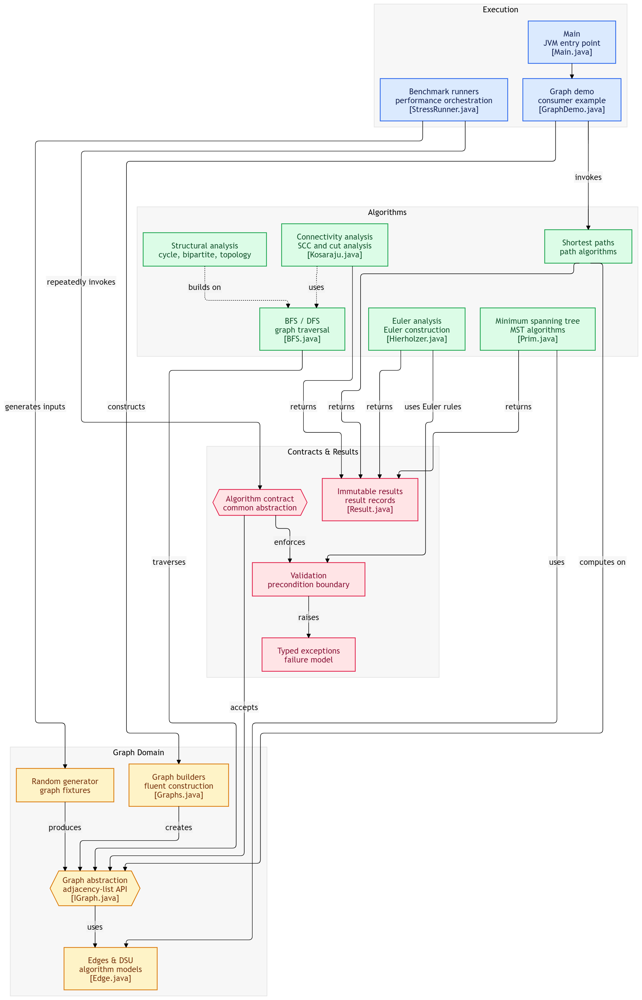

# Graphite

A modern Java graph algorithms library built from scratch with a focus on clean architecture, extensibility, and performance.

Graphite provides a unified API for graph creation, generation, validation, traversal, shortest paths, minimum spanning trees, connectivity algorithms, and stress testing.

---

## ✨ Features

### 📦 Graph Model

- Directed Graphs
- Undirected Graphs
- Weighted Graphs
- Unweighted Graphs
- Adjacency List representation
- Immutable algorithm result objects

---

## 🏗 Graph Creation

### Graph Builder

Build graphs manually using a fluent builder.

```java
Graph graph = GraphBuilder
        .undirected()
        .vertices(6)
        .weighted(true)
        .build();

graph.addEdge(0, 1, 5);
graph.addEdge(1, 2, 3);
graph.addEdge(2, 5, 7);
```

---

## 🎲 Random Graph Generator

Generate graphs for testing and benchmarking.

Supported options:

- Directed / Undirected
- Weighted / Unweighted
- Connected graphs
- Self-loops
- Parallel edges
- Configurable edge count
- Custom weight ranges

Example:

```java
Graph graph =
        RandomGraphGenerator
                .undirected()
                .vertices(100)
                .edges(250)
                .weighted(1, 20)
                .connected(true)
                .build();
```

Predefined generators include:

- Traversal Graph
- MST Graph
- Shortest Path Graph
- DAG
- Dense Graph
- Sparse Graph
- Bipartite Graph
- Tree Graph
- SCC Graph
- Bridge Graph
- Articulation Point Graph

---

# Algorithms

## 🌳 Traversal

- Breadth First Search (BFS)
- Depth First Search (DFS)

Returns:

- Traversal order
- Parent array
- Visited information

---

## 🔄 Cycle Detection

### Directed

- DFS Recursion Stack

### Undirected

- Parent Tracking DFS

---

## 📚 Topological Sorting

- DFS Topological Sort
- Kahn's Algorithm (BFS)

Works on Directed Acyclic Graphs (DAGs).

---

## 📍 Shortest Paths

### Dijkstra

Supports

- Positive weighted graphs
- Parent reconstruction
- Distance array

Automatically rejects graphs containing negative edges.

---

### Bellman-Ford

Supports

- Negative edge weights
- Negative cycle detection
- Parent reconstruction

Throws an exception when a negative cycle exists.

---

## 🌲 Minimum Spanning Tree

### Prim's Algorithm

Priority Queue implementation.

Returns

- MST Edges
- Total Weight

---

### Kruskal's Algorithm

Uses

- Disjoint Set Union (Union Find)
- Path Compression
- Union by Rank

Returns

- MST Edges
- Total Weight

---

## 🌐 Connectivity Algorithms

### Strongly Connected Components

- Kosaraju Algorithm

Returns every SCC as an independent component.

---

### Bridges

Finds every bridge in an undirected graph.

---

### Articulation Points

Finds every articulation point using DFS low-link values.

---

## ⚡ Graph Validation

Graphite automatically validates graphs before executing algorithms.

Validation includes:

- Invalid vertices
- Empty graphs
- Graph direction checks
- Connected graph requirements
- Negative edge detection
- Self-loop detection
- Weighted graph validation

---

## 📊 Results API

Algorithms return dedicated immutable result objects instead of printing directly.

Examples include:

- TraversalResult
- ShortestPathResult
- MSTResult

Example:

```java
ShortestPathAlgorithm algorithm = new Dijkstra();

ShortestPathResult result =
        algorithm.shortestPath(graph, 0);

System.out.println(result);
```

---

## 🧪 Stress Testing

Graphite includes a reusable stress testing framework for benchmarking algorithms.

Features

- Automatic graph generation
- Configurable test sizes
- Multiple iterations
- Execution time measurement
- Average runtime
- Best/Worst runtime
- Progress reporting

Example:

```java
StressRunner.run(
        "Dijkstra Stress Test",
        StressConfig.DEFAULT_CONFIG,
        GraphFactory::shortestPathGraph,
        algorithm::shortestPath
);
```

---

## 🏛 Architecture

Graphite follows a modular architecture separating graph representation, algorithms, generators, utilities, validation, and testing.

```
graphite
│
├── algorithms
│   ├── traversal
│   ├── cycle
│   ├── topological
│   ├── shortestpath
│   ├── mst
│   └── connectivity ...
│
├── builder
├── factory
├── generator
├── model
├── result
├── benchmark
├── util
├── validation
├── exception
└── examples
```

---

## 📁 Core Components

### Model

- Graph
- Edge
- Vertex
- Records

### Builder

- GraphBuilder

### Factory

- GraphFactory
- GraphType

### Generator

- RandomGraphGenerator

### Validation

- GraphValidator

### Utilities

- GraphPrinter
- GraphUtils

---

## 🚀 Example

```java
Graph graph =
        RandomGraphGenerator
                .undirected()
                .vertices(8)
                .edges(12)
                .weighted(1, 10)
                .connected(true)
                .build();

ShortestPathAlgorithm algorithm = new Dijkstra();

ShortestPathResult result =
        algorithm.shortestPath(graph, 0);

System.out.println(result.getDistance());

System.out.println(result.getParents());
```

---

## 📈 Current Implemented Algorithms

| Category | Algorithms |
|----------|------------|
| Traversal | BFS, DFS |
| Cycle Detection | Directed DFS, Undirected DFS |
| Topological Sorting | DFS Topological Sort, Kahn's Algorithm |
| Shortest Path | Dijkstra, Bellman-Ford |
| Minimum Spanning Tree | Prim, Kruskal |
| Connectivity | Kosaraju SCC, Bridges, Articulation Points |

---

## 🛣 Roadmap

### Graph Algorithms

- Floyd-Warshall
- Johnson's Algorithm
- A*
- Bidirectional Dijkstra
- SPFA

### Connectivity

- Tarjan SCC
- Biconnected Components
- Euler Path
- Euler Circuit
- Bipartite Checking

### Network Flow

- Ford-Fulkerson
- Edmonds-Karp
- Dinic
- Min-Cost Max-Flow

### Matching

- Hopcroft-Karp
- Hungarian Algorithm

### Advanced Data Structures

- Fibonacci Heap
- Indexed Priority Queue

### Visualization

- Graph Export
- DOT Format
- Interactive Visualizer

### Testing

- Property-Based Testing
- Benchmark Suite
- Performance Dashboard

---

## 🎯 Design Goals

- Clean object-oriented architecture
- Factory & Builder design patterns
- Immutable result objects
- Modular algorithm implementations
- Easy extensibility
- High-performance implementations
- Comprehensive validation
- Reusable stress testing framework

---

## **visualizer** 


## 📄 License

This project is licensed under the MIT License.
